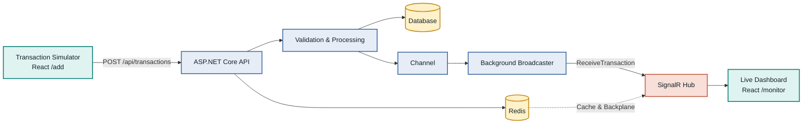

# Real-Time Financial Monitor

A real-time financial transaction monitor built with .NET 9, SignalR, React, TypeScript, PostgreSQL, SQLite, Redis, Docker, and Kubernetes.

## Run with Docker Compose

The quickest way to run the complete system is Docker Compose.

1. Start Docker Desktop.
2. From the repository root, run:

```bash
docker compose up --build
```

3. Open the application:

```text
http://localhost:8081
```

Docker Compose starts the React frontend, .NET API, PostgreSQL, and Redis together.

## Overview

The system accepts transactions through an API, processes them asynchronously, stores the result, and updates a live dashboard through SignalR.



## Main Features

- `POST /api/transactions` for transaction ingestion.
- `GET /api/transactions` for the initial dashboard snapshot.
- SignalR over WebSocket for real-time updates.
- `Pending` to `Completed` or `Failed` processing flow.
- Thread-safe asynchronous pipeline using `Channel<Transaction>`.
- Status filtering and responsive dashboard updates.
- Simulator for exactly 100 concurrent transactions.
- Optional Redis Backplane and distributed cache.

## Frontend Routes

| Route | Purpose |
|---|---|
| `/add` | Create transactions and run the 100-transaction load test. |
| `/monitor` | View stored transactions and receive live SignalR updates. |

## Architecture

### Backend layers

- **Domain**: transaction entities and statuses.
- **Application**: validation and transaction processing.
- **Infrastructure**: EF Core persistence, caching, Redis, and background broadcasting.
- **Presentation**: HTTP controllers and SignalR Hub.

### Runtime modes

| Environment | Database | Cache | Realtime |
|---|---|---|---|
| Local development | SQLite | In-memory | SignalR |
| Docker / multiple replicas | PostgreSQL | Redis | SignalR + Redis Backplane |

The application uses explicit configuration for each runtime mode:

- **Local development / one API instance:** SQLite is the persistent database and in-process memory is used as the cache.
- **Docker Compose or Kubernetes with multiple API replicas:** PostgreSQL is the shared source of truth, while Redis is used for the shared cache and SignalR Backplane.

Redis has two separate responsibilities in the multi-replica setup:

1. **Distributed cache:** speeds up repeated reads of the transaction snapshot. The cache is short-lived and invalidated after writes.
2. **SignalR Backplane:** distributes real-time messages between API replicas, so a client connected to one replica can receive a transaction processed by another.

PostgreSQL is the shared, authoritative data store. Redis does not replace the database.

## Transaction Processing

Every new transaction starts as `Pending`.

- Amount up to `10,000`: `Completed`.
- Amount above `10,000`: `Failed`.

The dashboard receives the lifecycle updates and replaces the existing row by `transactionId`.

## Run Locally

### Backend

From the repository root:

```bash
dotnet test FinancialMonitor.sln
dotnet run --project FinancialMonitor.Api
```

### Frontend

In a second terminal:

```bash
cd FinancialMonitor.Client
npm install
npm run dev
```

Open:

```text
http://localhost:5173
```

## Testing

Backend tests cover:

- Validation and transaction processing.
- Repository behavior and concurrency.
- HTTP ingestion and retrieval.
- Channel enqueueing.
- SignalR broadcasting.
- Concurrent requests.

Run all backend tests:

```bash
dotnet test FinancialMonitor.sln
```

Validate the frontend:

```bash
cd FinancialMonitor.Client
npm run build
npm run lint
```

## Cloud-Ready Design

The `k8s` directory contains example deployments for the API, frontend, and Redis. The API is designed to scale across replicas when connected to a shared PostgreSQL database and Redis Backplane.

For production, the deployment should additionally provide managed PostgreSQL, secrets management, health probes, resource limits, durable Redis configuration, and tagged container images.

## Key Challenges Solved

- Safe concurrent ingestion and storage.
- Non-blocking transaction processing with `Channel<T>`.
- Real-time lifecycle updates with SignalR.
- A single application-level SignalR connection across route navigation.
- Cache invalidation after database writes.
- Shared database and SignalR synchronization for multiple replicas.
- Responsive rendering during bursts of 100 transactions.
